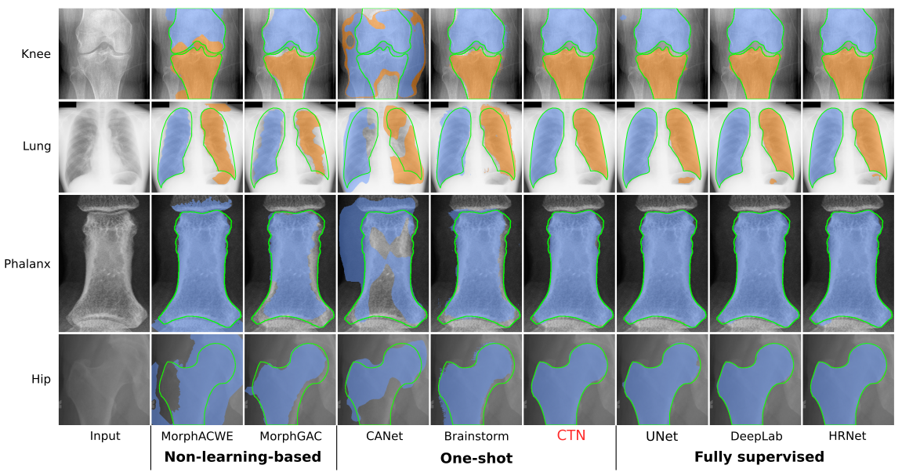

# Contour Transformer Network for One-shot Segmentation of Anatomical Structures

This repository is for the experiment data of the paper "Contour Transformer Network for One-shot Segmentation of Anatomical Structures", *IEEE Transactions on Medical Imaging*, 2020. ([PDF](https://arxiv.org/pdf/2012.01480.pdf))

If you have any question about this paper, please feel free to contact me at yuhang@email.sc.edu.


(Our method trained with only one label achieves comparable performance with fully supervised alternatives.)

## Knee dataset
Please download the original knee X-ray images from the [OAI dataset](https://nda.nih.gov/oai).

Image list: [knee_img_list.json](https://github.com/rudylyh/CTN_data/blob/master/knee_img_list.json)

Segmentation masks: [knee_data](https://github.com/rudylyh/CTN_data/tree/master/knee_data)

## Lung dataset
Please download the original lung images and ground truth segmentations from the [SCR dataset](https://www.isi.uu.nl/Research/Databases/SCR).

Image list: [lung_img_list.json](https://github.com/rudylyh/CTN_data/blob/master/lung_img_list.json)

## Phalanx dataset
The phalanx dataset is not publicly available for now.

## Hip dataset
Please download the original hip X-ray images from the [OAI dataset](https://nda.nih.gov/oai).

Image list: [hip_img_list.json](https://github.com/rudylyh/CTN_data/blob/master/hip_img_list.json)

Segmentation masks: [hip_data](https://github.com/rudylyh/CTN_data/tree/master/hip_data)

## Citation
If you are using this dataset in your work, please cite our paper:
```
@article{lu2020contour,
  title={Contour Transformer Network for One-shot Segmentation of Anatomical Structures},
  author={Lu, Yuhang and Zheng, Kang and Li, Weijian and Wang, Yirui and Harrison, Adam P and Lin, Chihung and Wang, Song and Xiao, Jing and Lu, Le and Kuo, Chang-Fu and Miao, Shun},
  journal={arXiv preprint arXiv:2012.01480},
  year={2020}
}
```
